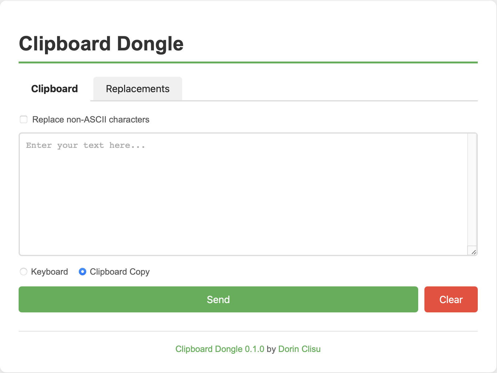

# Overview
HID keyboard device to paste clipboard contents from another device.

# Modes
### Wireless
- Circuitpython device embeds WiFi AP and a simple web page to input the text.

# TODO
- [x] Captive portal (DNS implementation)
- [x] Validate text before writing
- [x] Propose replacement table for characters
- [ ] Configurable AP name and password
- [ ] Configurable wifi client
- [ ] Support multiple boards
- [ ] Reset to defaults with button
